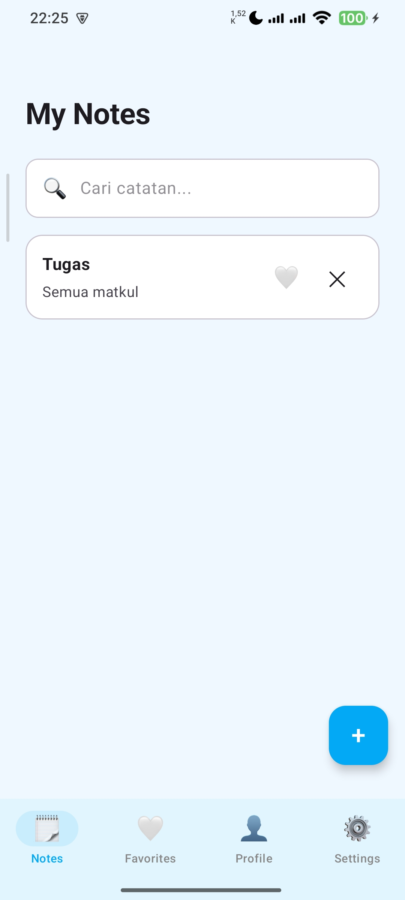
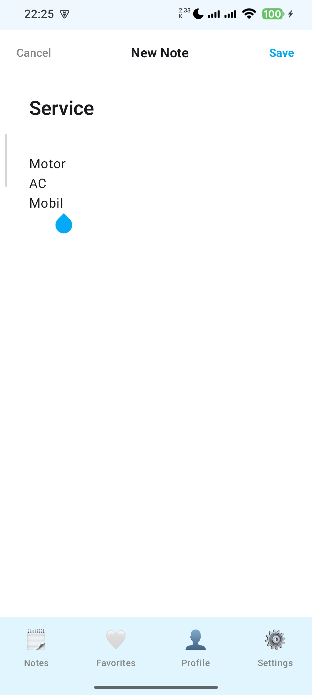
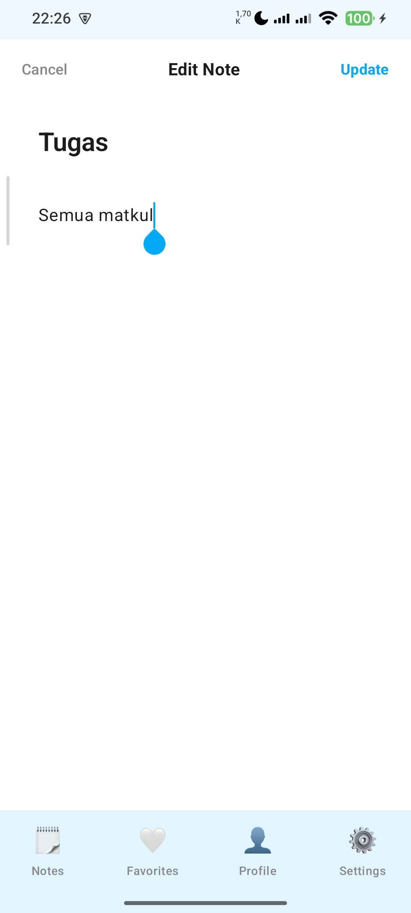
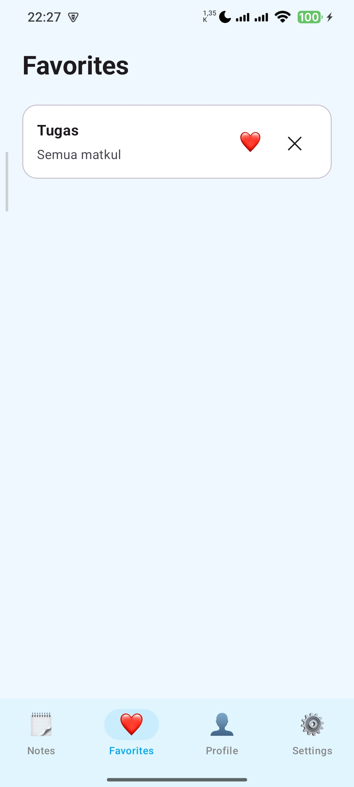
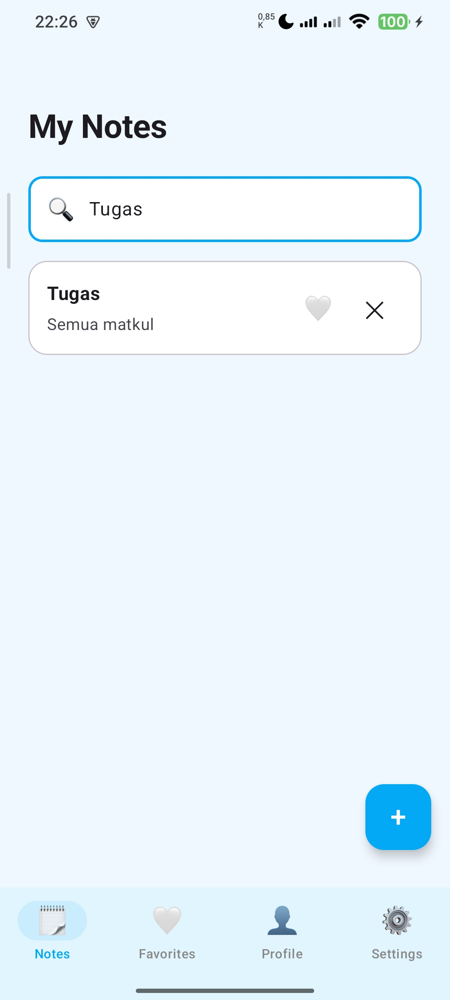
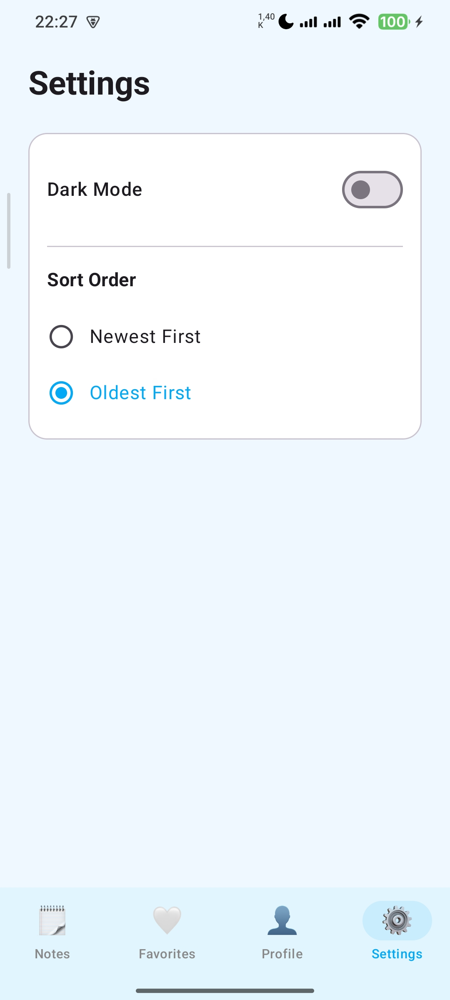
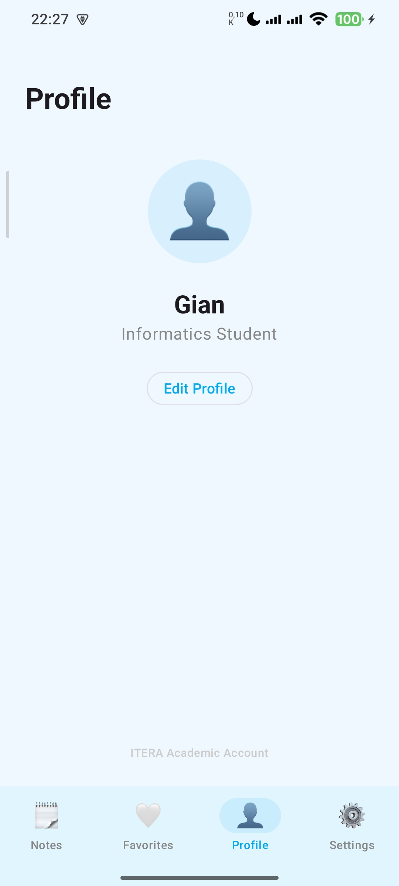
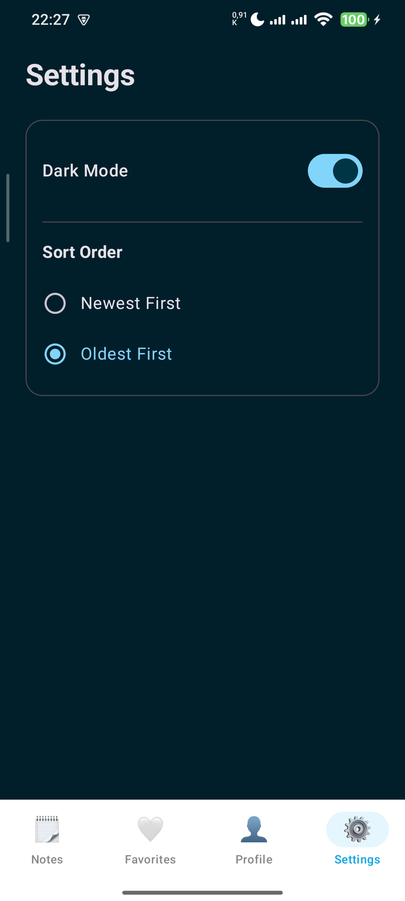

# 📝 Notes App V2 - Tugas Praktikum 7

Aplikasi pencatatan (Notes App) modern yang dibangun menggunakan **Kotlin Multiplatform (KMP)** dan **Compose Multiplatform**. Project ini difokuskan pada implementasi *Offline-First Architecture* yang mengandalkan penyimpanan database lokal dan manajemen *state* yang reaktif.

---

## 👨‍💻 Identitas Mahasiswa

* **Nama:** Gian Ivander
* **NIM:** 123140040
* **Kelas:** Pengembangan Aplikasi Mobile RA 

---

## ✨ Fitur Utama

* 📝 **CRUD Notes:** Create, Read, Update, dan Delete catatan dengan mudah.
* 🔍 **Search Notes:** Fitur pencarian catatan secara *real-time* berdasarkan judul atau isi.
* ⭐ **Favorite Notes:** Menandai catatan penting sebagai favorit.
* 🎨 **Settings (Theme):** Pengaturan mode tampilan (Terang/Gelap) yang tersimpan secara persisten.
* 📵 **Offline-First:** Aplikasi berfungsi penuh 100% tanpa memerlukan koneksi internet, data aman di penyimpanan lokal.
* ⚡ **Reactive UI:** Pembaruan antarmuka secara otomatis menggunakan *Kotlin Coroutines* dan *Flow*.

---

## 🧱 Arsitektur

Project ini menggunakan pola arsitektur **MVVM (Model-View-ViewModel)** yang dipadukan dengan **Repository Pattern** untuk memisahkan *logic* antarmuka dengan manajemen data.

**Alur Data (Data Flow):**
`UI (Compose)` ↔️ `ViewModel (StateFlow)` ↔️ `Repository` ↔️ `SQLDelight (Local DB)`

---

## 🗄️ Database Schema

Aplikasi menggunakan SQLDelight dengan skema tabel dan *query* yang didefinisikan pada file `Note.sq`:

```sql
CREATE TABLE NoteEntity (
    id INTEGER PRIMARY KEY AUTOINCREMENT,
    title TEXT NOT NULL,
    content TEXT NOT NULL,
    is_favorite INTEGER NOT NULL DEFAULT 0,
    created_at INTEGER NOT NULL
);

-- Mengambil semua catatan, diurutkan dari yang terbaru
selectAll:
SELECT * FROM NoteEntity ORDER BY created_at DESC;

-- Menambahkan catatan baru
insert:
INSERT INTO NoteEntity(title, content, is_favorite, created_at)
VALUES (?, ?, ?, ?);

-- Memperbarui catatan yang sudah ada
updateNote:
UPDATE NoteEntity SET title = ?, content = ? WHERE id = ?;

-- Menghapus catatan berdasarkan ID
deleteById:
DELETE FROM NoteEntity WHERE id = ?;

-- Mencari catatan berdasarkan kata kunci
search:
SELECT * FROM NoteEntity 
WHERE title LIKE '%' || :query || '%' OR content LIKE '%' || :query || '%';
```

Berikut gue rapihin jadi **README.md siap pakai (tinggal copas ke repo)** 👇

---

# ⚙️ Teknologi yang Digunakan

* **Kotlin Multiplatform (KMP)**
  Berbagi logic bisnis antar platform (Android, iOS, Desktop).

* **Compose Multiplatform**
  Framework UI deklaratif untuk membangun tampilan secara konsisten di berbagai platform.

* **SQLDelight**
  Type-safe SQL database untuk penyimpanan data lokal terstruktur (notes).

* **Multiplatform Settings**
  Implementasi DataStore (key-value storage) untuk menyimpan preferensi seperti tema.

* **Coroutines & Flow**
  Mengelola operasi asynchronous dan reactive data stream untuk update UI secara otomatis.

---

# 📸 Screenshots

| Fitur            | Tampilan                               |
|------------------|----------------------------------------|
| Home / Note List |           |
| Add Note         |    |
| Edit Note        |  |
| Favorite         |   |
| Search Feature   |  |
| Settings Screen  |    |
| Profile          |     |
| Dark Mode        |  |

---

# 🎥 Video Demo


---

# 🚀 Cara Menjalankan Project

1. Clone repository:

   ```bash
   git clone https://github.com/USERNAME/NAMA-REPO.git
   ```

2. Buka project menggunakan:

    * Android Studio / IntelliJ IDEA

3. Tunggu hingga **Gradle Sync selesai**

4. Pilih target run:

    * `composeApp` (Android / Desktop / iOS)

5. Jalankan aplikasi:

    * Klik **Run** atau tekan `Shift + F10`

---

# 🧠 Konsep yang Dipelajari

Melalui praktikum ini, beberapa konsep penting yang dipahami:

* **Local Storage**
  Pentingnya menyimpan data di sisi client untuk performa dan akses offline.

* **SQLDelight**
  Implementasi database lokal dengan pendekatan type-safe dan auto-generated code.

* **DataStore (Multiplatform Settings)**
  Penyimpanan sederhana berbasis key-value untuk preferences.

* **Offline-First Architecture**
  Aplikasi tetap dapat digunakan tanpa koneksi internet dengan memanfaatkan database lokal.

* **Reactive Programming (Flow)**
  UI otomatis update ketika data berubah.
